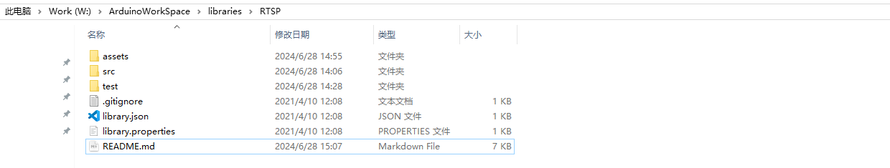
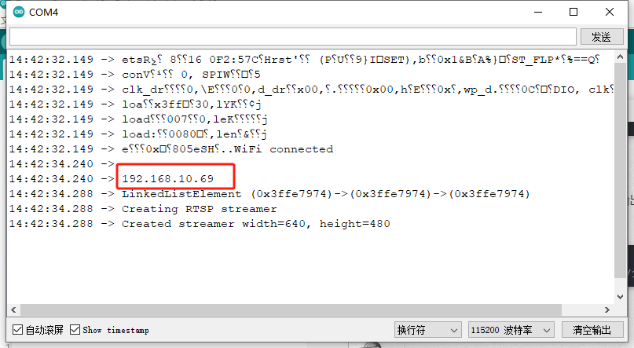
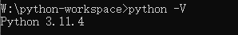
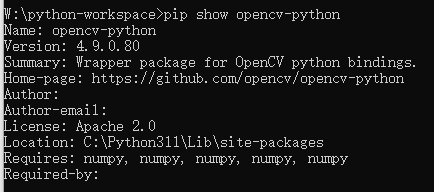
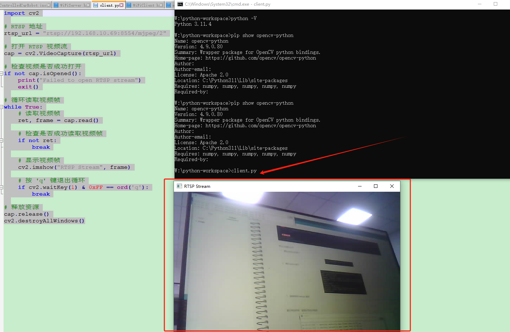
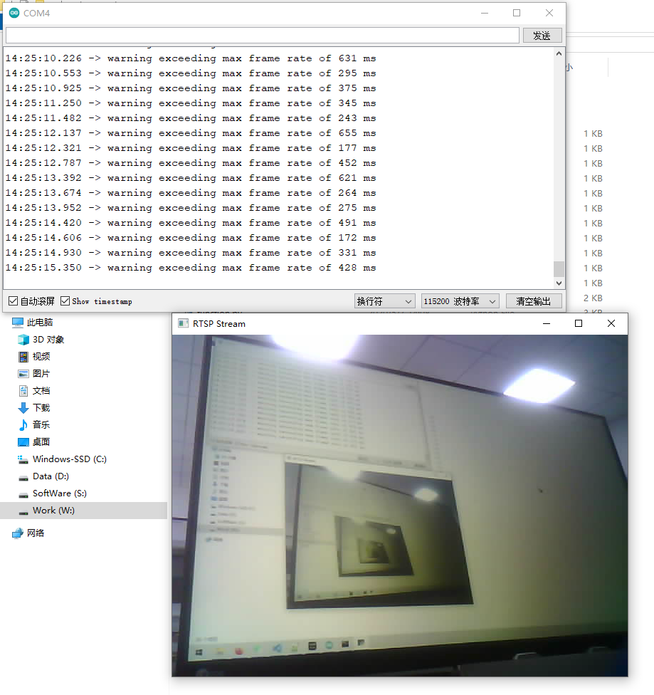
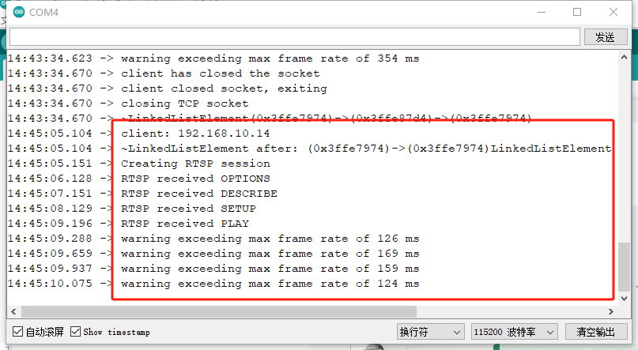
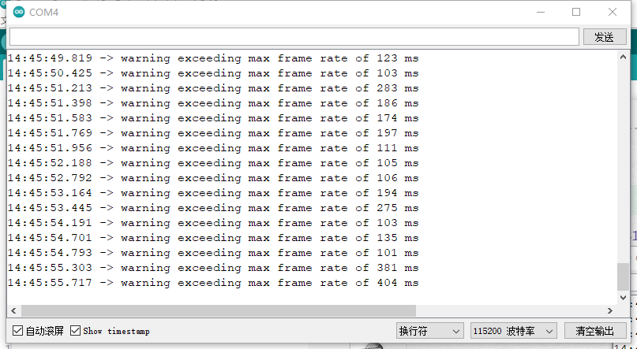
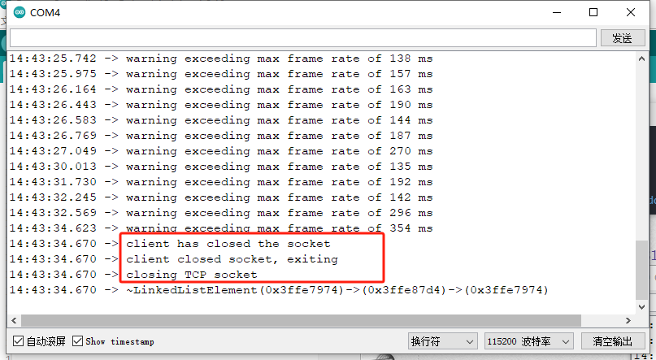

# RTSP

This is a small library which can be used to serve up RTSP streams from
resource constrained MCUs.  

# Usage

This library works for ESP32/arduino 

## Example arduino/ESP32 usage

**目的：使用ESP32-CAM进行视频推流，python端作为rtsp拉流**


### 服务端搭建

开发环境：arduino

开发板: ESP32-WROVER-CAM (FREENOVE)


库文件：[RTSP](https://github.com/InterFF/RTSP)

库文件安装：手动将库文件解压到 lib目录




本地局域网传输

代码实例

```c++
#include <Arduino.h>
#include <WiFi.h>
#include <WebServer.h>
#include <WiFiClient.h>

//RTSP Library
#include "SimStreamer.h"
#include "CAM32Streamer.h"
#include "CRtspSession.h"
 
// copy this file to wifikeys.h and edit
const char *ssid =     "********"  // Put your SSID here
const char *password = "*******";     // Put your PASSWORD here
 
#define ENABLE_RTSPSERVER

//------------Camera Board Type------------------

#define PWDN_GPIO_NUM    -1
#define RESET_GPIO_NUM   -1
#define XCLK_GPIO_NUM    21
#define SIOD_GPIO_NUM    26
#define SIOC_GPIO_NUM    27

#define Y9_GPIO_NUM      35
#define Y8_GPIO_NUM      34
#define Y7_GPIO_NUM      39
#define Y6_GPIO_NUM      36
#define Y5_GPIO_NUM      19
#define Y4_GPIO_NUM      18
#define Y3_GPIO_NUM       5
#define Y2_GPIO_NUM       4
#define VSYNC_GPIO_NUM   25
#define HREF_GPIO_NUM    23
#define PCLK_GPIO_NUM    22

CAM32 cam;
 
WiFiServer rtspServer(8554);
 
CStreamer *streamer;
  

void handleStreaming() {
    uint32_t msecPerFrame = 100;
    static uint32_t lastimage = millis();

    // If we have an active client connection, just service that until gone
    streamer->handleRequests(0); // we don't use a timeout here,
    // instead we send only if we have new enough frames
    uint32_t now = millis();
    if(streamer->anySessions()) {
        if(now > lastimage + msecPerFrame || now < lastimage) { // handle clock rollover
            streamer->streamImage(now);
            lastimage = now;

            // check if we are overrunning our max frame rate
            now = millis();
            if(now > lastimage + msecPerFrame) {
                printf("warning exceeding max frame rate of %d ms\n", now - lastimage);
            }
        }
    }
    
    WiFiClient rtspClient = rtspServer.accept();
    if(rtspClient) {
        Serial.print("client: ");
        Serial.print(rtspClient.remoteIP());
        Serial.println();
        streamer->addSession(rtspClient);
    }
}


void setupCamera(){


  camera_config_t config;
  config.ledc_channel = LEDC_CHANNEL_0;
  config.ledc_timer = LEDC_TIMER_0;
  config.pin_d0 = Y2_GPIO_NUM;
  config.pin_d1 = Y3_GPIO_NUM;
  config.pin_d2 = Y4_GPIO_NUM;
  config.pin_d3 = Y5_GPIO_NUM;
  config.pin_d4 = Y6_GPIO_NUM;
  config.pin_d5 = Y7_GPIO_NUM;
  config.pin_d6 = Y8_GPIO_NUM;
  config.pin_d7 = Y9_GPIO_NUM;
  config.pin_xclk = XCLK_GPIO_NUM;
  config.pin_pclk = PCLK_GPIO_NUM;
  config.pin_vsync = VSYNC_GPIO_NUM;
  config.pin_href = HREF_GPIO_NUM;
  config.pin_sscb_sda = SIOD_GPIO_NUM;
  config.pin_sscb_scl = SIOC_GPIO_NUM;
  config.pin_pwdn = PWDN_GPIO_NUM;
  config.pin_reset = RESET_GPIO_NUM;
  config.xclk_freq_hz = 20000000;
  config.pixel_format = PIXFORMAT_JPEG; 
  
  if(psramFound()){
    config.frame_size = FRAMESIZE_VGA;
    config.jpeg_quality = 10;
    config.fb_count = 2;
  } else {
    config.frame_size = FRAMESIZE_SVGA;
    config.jpeg_quality = 12;
    config.fb_count = 1;
  }
  
  // Camera init
  esp_err_t err = cam.init(config);
  if (err != ESP_OK) {
    Serial.printf("Camera init failed with error 0x%x", err);
    return;
  }


}


void setupWiFi(){
    IPAddress ip;
 
    WiFi.mode(WIFI_STA);
    WiFi.begin(ssid, password);
    while (WiFi.status() != WL_CONNECTED)
    {
        delay(500);
        Serial.print(F("."));
    }
    ip = WiFi.localIP();
    Serial.println(F("WiFi connected"));
    Serial.println("");
    Serial.println(ip);  
}

void setupStreaming() {
    rtspServer.begin();  
    streamer = new CAM32Streamer(cam); //Streamer for UDP/TCP based RTP transport
}

void setup()
{
    Serial.begin(115200);
    while (!Serial);
    
    setupCamera();
    setupWiFi();
    setupStreaming();

}
 
void loop()
{
    handleStreaming();
}


```


ArduinoIDE串口监视器输出的初始化信息，我们需要将ESP32的IP地址安装RTSP协议推流的格式填入Python拉流代码中。



```
# RTSP 地址
rtsp_url = "rtsp://192.168.10.69:8554/mjpeg/2"
```


### 客户端的使用

环境：python3

依赖库：pip install opencv-python

本教程使用的是win10系统，编写一下脚本 client.py。


```python
import cv2
 
# RTSP 地址
rtsp_url = "rtsp://192.168.10.69:8554/mjpeg/2"
 
# 打开 RTSP 视频流
cap = cv2.VideoCapture(rtsp_url)
 
# 检查视频是否成功打开
if not cap.isOpened():
    print("Failed to open RTSP stream")
    exit()
 
# 循环读取视频帧
while True:
    # 读取视频帧
    ret, frame = cap.read()
 
    # 检查是否成功读取视频帧
    if not ret:
        break
 
    # 显示视频帧
    cv2.imshow("RTSP Stream", frame)
 
    # 按 'q' 键退出循环
    if cv2.waitKey(1) & 0xFF == ord('q'):
        break
 
# 释放资源
cap.release()
cv2.destroyAllWindows()
```

然后cmd窗口打开

1. 确认python3安装了



2. 确认opencv装了



3. 直接调用client.py 脚本，没啥问题的话会弹出一个视频窗口，代表成功了




最后调试结果：能够正常显示视频




----


> 建立连接




> 数据传输



>  连接关闭


